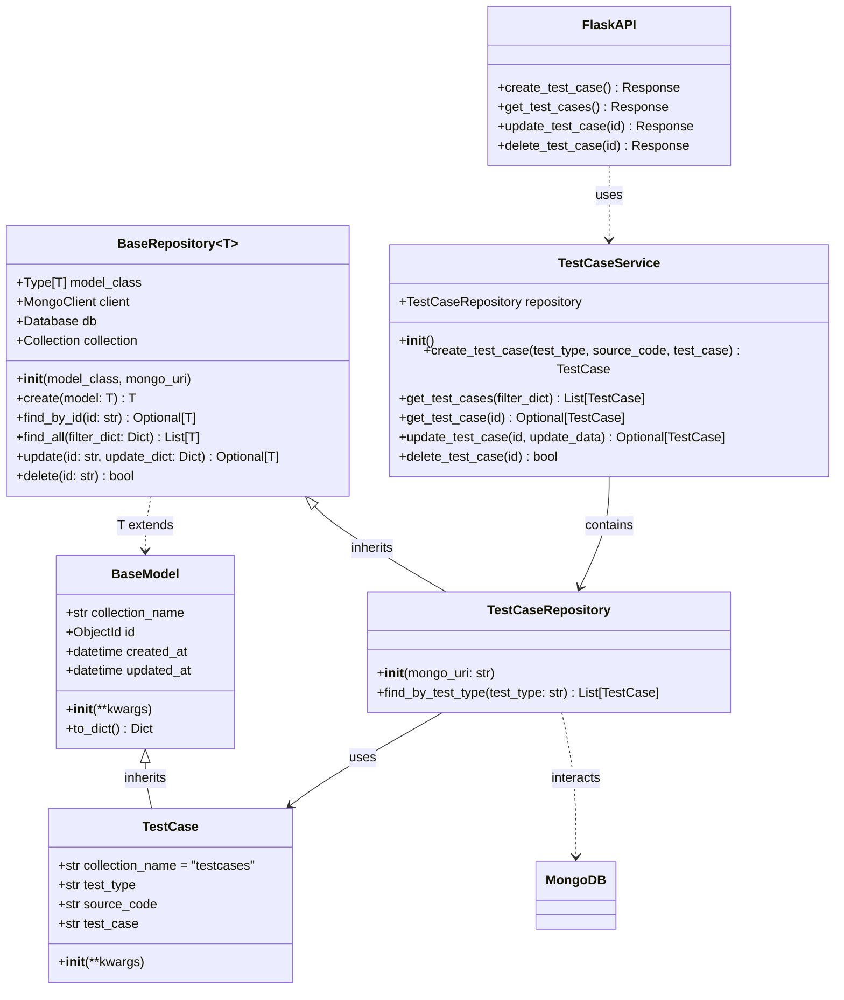

# Backend Database Architecture

## From Frontend to Backend: Database Implementation Migration

This document outlines the architectural changes made to move database operations from the frontend to the backend, implementing a clean separation of concerns using the Repository Design Pattern.

## Overview

Previously, our application directly connected to MongoDB from the frontend using TypeScript. This approach presented several challenges including:

- Limited separation of concerns
- Difficulty implementing complex validation
- Cross-platform compatibility issues

## Architecture Components

### Repository Design Pattern

We've implemented the **Repository Design Pattern**, which provides:

- A clean separation between data access logic and business logic
- Abstraction of the underlying database technology
- Improved testability through dependency injection
- Standardized CRUD operations across entities

### Component Structure

```raw

db/
├── models/          # Data models representing database entities
├── repositories/    # Data access layer for CRUD operations
└── services/        # Business logic layer using repositories

```



#### Model Layer

Models represent the database entities and their properties.
The ``BaseModel`` provides common functionality like ID generation and timestamp management.

#### Repositories Layer

Repositories handle direct interaction with the database, providing CRUD operations:
The ``BaseRepository`` implements generic CRUD operations like ``create``, ``find_by_id``, ``find_all``, ``update`` and ``delete``.

#### Services Layer

Services encapsulate business logic, using repositories for data access.

#### API Layer

Flask routes expose the database operations through RESTful endpoints:

```python

@app.route("/db/testcases", methods=["POST"])
@app.route("/db/testcases", methods=["GET"])
@app.route("/db/testcases/<id>", methods=["DELETE"])
@app.route("/db/testcases/<id>", methods=["PUT"])

```

### Benefits of the New Architecture

1. Better Separation of Concerns: Each layer has a single responsibility
2. Enhanced Maintainability: Changes to the database don't require frontend changes
3. Consistent API: Standardized endpoints for all database operations
4. Improved Testability: Each layer can be tested independently
5. Scalability: Backend can be scaled separately from frontend

#### Testing

The architecture supports comprehensive testing:

- Unit tests for models and services
- Integration tests for DB
- API tests for endpoints

## Conclusion

Moving the database operations from the frontend to a backend API following the Repository Design Pattern has significantly improved our application's architecture. The separation of concerns, improved testing and enhanced maintainability make the application more robust and easier to extend.
