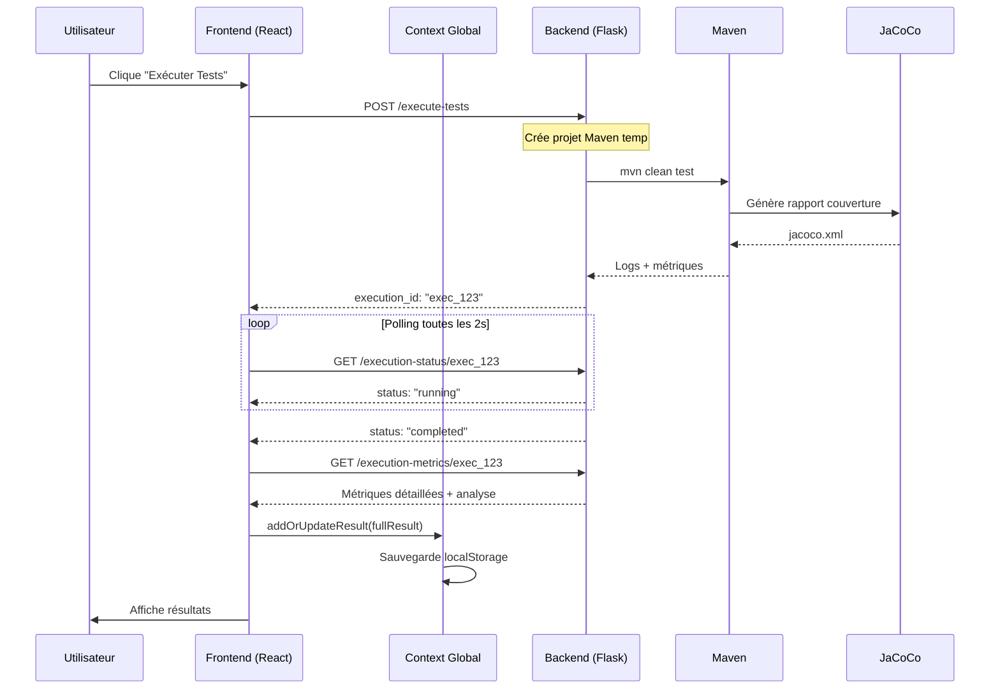
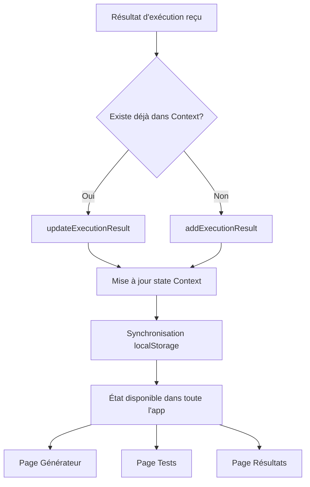

# Documentation du Module d'Exécution de Tests

## Table des Matières
1. [Vue d'ensemble](#vue-densemble)
2. [Architecture](#architecture)
3. [Flux d'Exécution Complet](#flux-dexecution-complet)
4. [Métriques Collectées](#metriques-collectees)
5. [Points Clés](#points-cles)
6. [Diagrammes de Séquence](#diagrammes-de-sequence)
7. [API Endpoints](#api-endpoints)
---

## Vue d'ensemble

Le module d'exécution de tests permet de :

- **Exécuter automatiquement** des tests Java/Spring Boot générés par l'IA
- **Collecter des métriques** détaillées (couverture, succès, qualité)
- **Analyser la qualité** des tests avec scoring automatique
- **Afficher les résultats** en temps réel avec interface interactive
- **Persister l'historique** pour comparaisons futures

### Technologies utilisées

**Frontend:**

- Next.js 14+ (App Router)
- React Context API (gestion d'état)
- TypeScript
- Tailwind CSS

**Backend:**

- Python Flask
- Maven (build/test Java)
- JaCoCo (couverture de code)
- Spring Boot (exécution des tests)

---

## Architecture

```
┌─────────────────────────────────────────────────────────────┐
│                    FRONTEND (Next.js)                        │
├─────────────────────────────────────────────────────────────┤
│                                                              │
│  ┌──────────────┐    ┌──────────────┐    ┌──────────────┐ │
│  │   Générateur │───▶│    Tests     │───▶│  Résultats   │ │
│  │   (page.tsx) │    │(tests/page)  │    │(results/page)│ │
│  └──────────────┘    └──────────────┘    └──────────────┘ │
│         │                    │                    │         │
│         └────────────────────┼────────────────────┘         │
│                              ▼                               │
│                    ┌──────────────────┐                     │
│                    │  AppContext      │                     │
│                    │  (State Global)  │                     │
│                    └──────────────────┘                     │
│                              │                               │
└──────────────────────────────┼───────────────────────────────┘
                               │
                               ▼ HTTP Requests
┌─────────────────────────────────────────────────────────────┐
│                    BACKEND (Flask)                           │
├─────────────────────────────────────────────────────────────┤
│                                                              │
│  POST /execute-tests                                         │
│       │                                                      │
│       ├─▶ Crée projet Maven temporaire                      │
│       ├─▶ Configure pom.xml (Spring Boot + JaCoCo)         │
│       ├─▶ Génère TestApplication.java                       │
│       ├─▶ Place les tests dans src/test/java               │
│       └─▶ Lance mvn clean test                             │
│                                                              │
│  GET /execution-status/{id}                                  │
│       └─▶ Retourne état + métriques de base                │
│                                                              │
│  GET /execution-metrics/{id}                                 │
│       └─▶ Parse JaCoCo XML + analyse détaillée             │
│                                                              │
└─────────────────────────────────────────────────────────────┘
                               │
                               ▼
                    ┌──────────────────┐
                    │  Maven + JaCoCo  │
                    │  (Build & Test)  │
                    └──────────────────┘
```

---

## Flux d'Exécution Complet

### **Démarrage de l'exécution**

#### Depuis la page Générateur (`code-panel.tsx`)

Lorsque l'utilisateur clique sur le bouton "Exécuter Tests", le processus suivant se déclenche :

**Étapes du processus :**

1. **Validation initiale** : Le système vérifie que du code de test a bien été généré. Si aucun code n'est présent, un message d'erreur s'affiche.
2. **Initialisation de l'état** : L'interface passe en mode "exécution en cours" avec un indicateur visuel (spinner) et le statut est défini sur "starting".
3. **Appel à l'API Backend** : Une requête HTTP POST est envoyée au serveur Flask à l'endpoint `/execute-tests` avec deux paramètres :

   - Le code des tests générés (outputCode)
   - Le code source de l'API à tester (sourceCode)
4. **Réception de l'ID d'exécution** : Le backend répond immédiatement avec un identifiant unique d'exécution (par exemple "exec_1730123456789") qui servira à suivre le statut de cette exécution spécifique. Le statut passe à "started".

#### Depuis la page Tests (Historique)

L'utilisateur peut également ré-exécuter un test depuis la page d'historique :

**Processus de ré-exécution :**

1. **Sélection du test** : L'utilisateur clique sur le bouton "Play" d'un test précédemment généré dans l'historique.
2. **Envoi de la requête** : Une requête POST est envoyée avec le code du test et le code API stockés dans l'historique.
3. **Création des métadonnées** : Le système attache des informations de traçabilité au résultat :

   - ID du test dans l'historique
   - Code source original
   - Code des tests générés
   - Type de test (RestAssured, JUnit, etc.)
4. **Récupération asynchrone** : Une fonction dédiée (`fetchAndSaveResult`) est appelée pour récupérer les résultats une fois l'exécution terminée.
5. **Navigation automatique** : L'utilisateur est redirigé vers la page de résultats détaillés avec l'ID d'exécution dans l'URL.

---

### **Backend : Traitement de la requête**

#### Configuration Maven (`spring_boot.py`)

Lorsque le backend Flask reçoit une demande d'exécution de tests, il effectue les étapes suivantes :

**Création du projet Maven temporaire :**

Le système génère automatiquement un fichier `pom.xml` (configuration Maven) contenant :

**Dépendances configurées :**

- **Spring Boot Web (v3.3.5)** : Framework pour créer l'application Spring Boot qui sera testée
- **Spring Boot Test** : Bibliothèque contenant les outils de test Spring (MockMvc, annotations @SpringBootTest, etc.)
- **RestAssured (v5.4.0)** : Framework spécialisé pour tester les APIs REST avec une syntaxe fluide
- **JaCoCo (v0.8.10)** : Plugin de couverture de code qui analyse quelles lignes/branches sont exécutées pendant les tests

**Plugins Maven configurés :**

1. **Maven Surefire Plugin** :

   - Responsable de l'exécution des tests JUnit
   - Configuré pour passer les paramètres JaCoCo via `argLine`
   - Identifie automatiquement tous les fichiers se terminant par `*Test.java` ou `*Tests.java`
2. **JaCoCo Plugin** :

   - **Phase prepare-agent** : Démarre l'agent JaCoCo avant l'exécution des tests pour instrumenter le bytecode
   - **Phase report** : Génère le rapport de couverture au format XML et HTML après l'exécution des tests
   - Les rapports sont générés dans `target/site/jacoco/`

#### Structure du projet généré

```
temp_project_exec_123456/
├── pom.xml
├── src/
│   ├── main/
│   │   └── java/
│   │       └── com/
│   │           └── test/
│   │               └── TestApplication.java  ← Code API
│   └── test/
│       └── java/
│           └── com/
│               └── test/
│                   └── GeneratedTest.java    ← Tests générés
└── target/
    └── site/
        └── jacoco/
            └── jacoco.xml                     ← Rapport de couverture
```

## Métriques Collectées

| Métrique                      | Source              | Description                                           |
| ------------------------------ | ------------------- | ----------------------------------------------------- |
| **tests_run**            | Maven Surefire      | Nombre total de tests exécutés                      |
| **failures**             | Maven Surefire      | Nombre de tests échoués                             |
| **errors**               | Maven Surefire      | Nombre d'erreurs d'exécution                         |
| **skipped**              | Maven Surefire      | Nombre de tests ignorés                              |
| **success_rate**         | Calculé            | `(tests_run - failures - errors) / tests_run * 100` |
| **build_success**        | Maven Surefire      | Statut du build Maven (SUCCESS/FAILURE)              |
| **line_coverage**        | JaCoCo XML          | Pourcentage de lignes couvertes                       |
| **branch_coverage**      | JaCoCo XML          | Pourcentage de branches couvertes                     |
| **instruction_coverage** | JaCoCo XML          | Pourcentage d'instructions couvertes                  |
| **lines_covered**        | JaCoCo XML          | Nombre de lignes couvertes                            |
| **lines_total**          | JaCoCo XML          | Nombre total de lignes                                |
| **branches_covered**     | JaCoCo XML          | Nombre de branches couvertes                          |
| **branches_total**       | JaCoCo XML          | Nombre total de branches                              |
| **instructions_covered** | JaCoCo XML          | Nombre d'instructions couvertes                       |
| **instructions_total**   | JaCoCo XML          | Nombre total d'instructions                           |
| **endpoints_count**      | Analyse du code API | Nombre d'endpoints détectés                         |
| **tests_per_endpoint**   | Calculé            | `tests_run / endpoints_count`                       |

---

## Points Clés

**Exécution asynchrone** : Polling toutes les 2 secondes, pas de blocage UI
**Persistance multi-niveaux** : Context + localStorage
**Métriques détaillées** : Couverture JaCoCo + analyse qualité
**Traçabilité complète** : Lien entre tests générés et résultats d'exécution
**Interface réactive** : Affichage temps réel avec animations de statut
**Recommandations intelligentes** : Suggestions d'amélioration automatiques
---

## 📐 Diagrammes de Séquence

### Exécution de Test Complète



### Workflow de Sauvegarde des Résultats



---

## API Endpoints

### Base URL
```
http://localhost:5000
```

### CORS
Origines autorisées: `http://localhost:3000`, `http://localhost:3001`

---

### POST `/rest-assured-test/gemini`

**Description:** Génère un test RestAssured à partir du code API Spring Boot en utilisant Gemini AI.

**Headers:**
```http
Content-Type: application/json
```

**Request Body:**
```json
{
  "api_code": "string"
}
```

**Réponse Success (200):**
```json
{
  "generated_test": "string"
}
```

**Réponses d'erreur:**

| Code | Description | Body |
|------|-------------|------|
| `400` | Paramètre `api_code` manquant | `{"error": "Missing api_code parameter"}` |
| `400` | Clé API Gemini manquante | `{"error": "Missing GEMINI_API_KEY in environment variables"}` |
| `500` | Erreur lors de la génération | `{"error": "string"}` |

**Processus interne:**
1. Analyse du code API avec Gemini (extraction des endpoints via prompt d'analyse)
2. Génération d'un test de base avec RestAssured
3. Retour du test généré (amélioration désactivée: `skipping_enhancement = True`)

---

### POST `/execute-tests`

**Description:** Lance l'exécution des tests Java dans un projet Maven temporaire et retourne un ID d'exécution.

**Headers:**
```http
Content-Type: application/json
```

**Request Body:**
```json
{
  "test_code": "string",
  "api_code": "string"
}
```

**Réponse Success (200):**
```json
{
  "execution_id": "string",
  "status": "started",
  "message": "Test execution started"
}
```

**Notes:**
- L'`execution_id` est généré avec `uuid.uuid4()`
- L'exécution se fait en arrière-plan (thread daemon)
- Timeout d'exécution Maven: 300 secondes (5 minutes)
- Commande Maven exécutée: `mvn clean test jacoco:report`

---

### GET `/execution-status/{execution_id}`

**Description:** Récupère le statut et les métriques de base d'une exécution.

**Paramètres URL:**
- `execution_id` (string, requis): UUID retourné par `/execute-tests`

**Réponse Success (200):**
```json
{
  "execution_id": "string",
  "status": "string",
  "logs": "string",
  "metrics": {
    "tests_run": 0,
    "failures": 0,
    "errors": 0,
    "skipped": 0,
    "success_rate": 0.0,
    "build_success": false,
    "line_coverage": 0.0,
    "branch_coverage": 0.0,
    "instruction_coverage": 0.0,
    "lines_covered": 0,
    "lines_total": 0,
    "branches_covered": 0,
    "branches_total": 0,
    "instructions_covered": 0,
    "instructions_total": 0,
    "endpoints_count": 0,
    "tests_per_endpoint": 0.0,
    "execution_time": 0.0,
    "return_code": 0
  },
  "start_time": 0.0,
  "end_time": 0.0
}
```

**Valeurs possibles pour `status`:**

| Status | Description |
|--------|-------------|
| `running` | Tests Maven en cours d'exécution |
| `completed` | Exécution terminée avec succès (return_code = 0) |
| `failed` | Exécution terminée avec échec (return_code ≠ 0) |
| `timeout` | Timeout après 5 minutes d'exécution |
| `error` | Erreur Python lors de l'exécution |

**Format des timestamps:**
- `start_time` et `end_time` sont en secondes Unix (epoch time via `time.time()`)
- `end_time` est `null` si le statut est `running`

---

### GET `/execution-metrics/{execution_id}`

**Description:** Récupère les métriques détaillées avec analyse de qualité et recommandations basées sur les seuils.

**Paramètres URL:**
- `execution_id` (string, requis): UUID de l'exécution

**Réponse Success (200):**
```json
{
  "execution_id": "string",
  "metrics": {
    "tests_run": 0,
    "failures": 0,
    "errors": 0,
    "skipped": 0,
    "success_rate": 0.0,
    "build_success": false,
    "line_coverage": 0.0,
    "branch_coverage": 0.0,
    "instruction_coverage": 0.0,
    "lines_covered": 0,
    "lines_total": 0,
    "branches_covered": 0,
    "branches_total": 0,
    "instructions_covered": 0,
    "instructions_total": 0,
    "endpoints_count": 0,
    "tests_per_endpoint": 0.0,
    "execution_time": 0.0,
    "return_code": 0
  },
  "quality_analysis": {
    "coverage_quality": "string",
    "test_completeness": "string",
    "overall_score": 0.0
  },
  "recommendations": ["string"],
  "coverage_summary": {
    "line_coverage": "string",
    "branch_coverage": "string",
    "instruction_coverage": "string",
    "tests_per_endpoint": "string",
    "total_endpoints": 0,
    "total_tests": 0
  }
}
```

**Valeurs possibles pour `coverage_quality`:**
- `poor`: line_coverage < 60% OU branch_coverage < 50%
- `fair`: line_coverage ≥ 60% ET branch_coverage ≥ 50%
- `good`: line_coverage ≥ 80% ET branch_coverage ≥ 70%
- `excellent`: line_coverage ≥ 90% ET branch_coverage ≥ 85%

**Valeurs possibles pour `test_completeness`:**
- `insufficient`: tests_per_endpoint < 1
- `minimal`: tests_per_endpoint ≥ 1
- `adequate`: tests_per_endpoint ≥ 2
- `comprehensive`: tests_per_endpoint ≥ 3

**Calcul du `overall_score` (0-100):**
```
coverage_score = line_coverage * 0.4 + branch_coverage * 0.4 + instruction_coverage * 0.2
test_score = min(100, tests_per_endpoint * 25)
overall_score = coverage_score * 0.7 + test_score * 0.3
```

**Recommandations générées automatiquement:**
- Si `line_coverage < 70`: "Augmenter la couverture de lignes (cible: 80%+)"
- Si `branch_coverage < 60`: "Améliorer la couverture des branches - tester tous les cas if/else/switch"
- Si `tests_per_endpoint < 2`: "Ajouter plus de tests par endpoint (recommandé: 2-3 tests minimum)"
- Si `endpoints_count > 0` ET `tests_run == 0`: "Aucun test détecté - implémenter des tests pour tous les endpoints"
- Si aucune recommandation: "Excellente couverture de tests ! Continuer les bonnes pratiques."

---

## Flux d'Exécution Backend

### Structure des données `test_executions`
```python
test_executions = {
    "execution_id": {
        "status": "running",  # running | completed | failed | timeout | error
        "start_time": 1730123456.789,  # Unix timestamp
        "end_time": 1730123501.234,    # Unix timestamp (null si running)
        "logs": "Maven output logs...",
        "metrics": {
            "tests_run": 5,
            "failures": 0,
            "errors": 0,
            "skipped": 0,
            "success_rate": 100.0,
            "build_success": True,
            "line_coverage": 85.5,
            "branch_coverage": 78.2,
            "instruction_coverage": 82.3,
            "lines_covered": 342,
            "lines_total": 400,
            "branches_covered": 156,
            "branches_total": 200,
            "instructions_covered": 1645,
            "instructions_total": 2000,
            "endpoints_count": 3,
            "tests_per_endpoint": 1.67,
            "execution_time": 45.5,
            "return_code": 0
        }
    }
}
```

### Processus d'exécution Maven

1. **Création projet temporaire** (`tempfile.TemporaryDirectory()`)
   - Génération du `pom.xml` avec dépendances Spring Boot + JaCoCo
   - Structure Maven: `src/main/java/` et `src/test/java/`

2. **Écriture des fichiers**
   - `TestApplication.java` dans `src/main/java/` (wrapping du code API)
   - `{ClassNameTest}.java` dans `src/test/java/` (code de test)

3. **Exécution Maven**
   - Commande: `mvn clean test jacoco:report`
   - Timeout: 300 secondes
   - Capture: `stdout` + `stderr`

4. **Parsing des résultats**
   - Parsing logs Maven avec regex pour extraire les métriques de tests
   - Parsing `target/site/jacoco/jacoco.xml` pour les métriques de couverture JaCoCo
   - Comptage des endpoints via analyse du code API

5. **Mise à jour du statut**
   - `completed` si `return_code == 0`
   - `failed` si `return_code != 0`
   - `timeout` si dépassement de 300 secondes
   - `error` si exception Python

---
