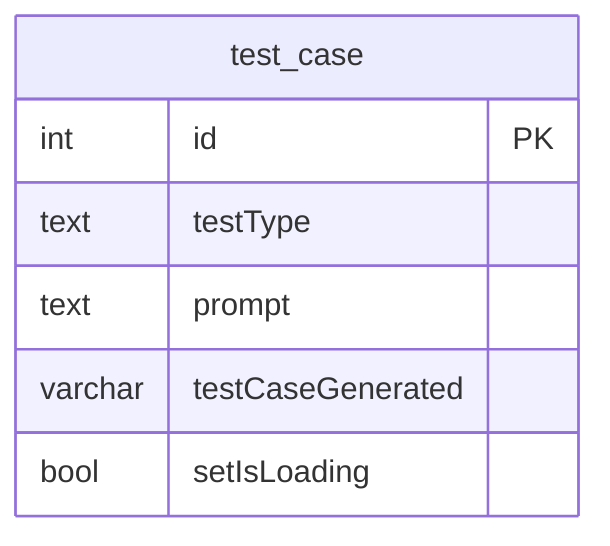
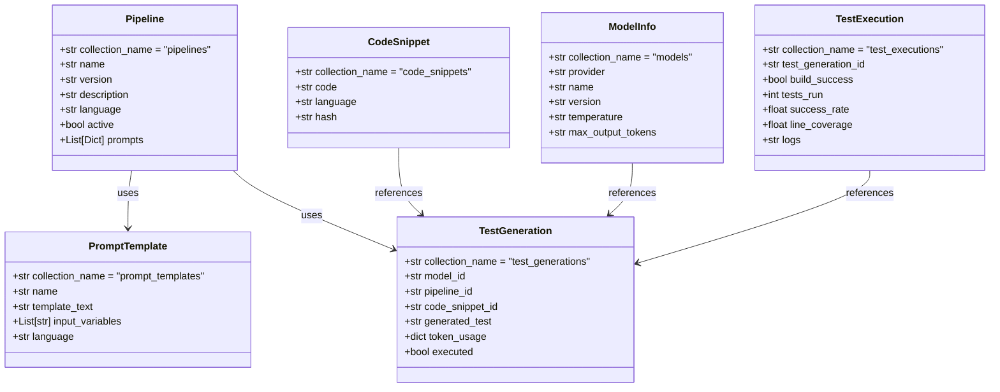
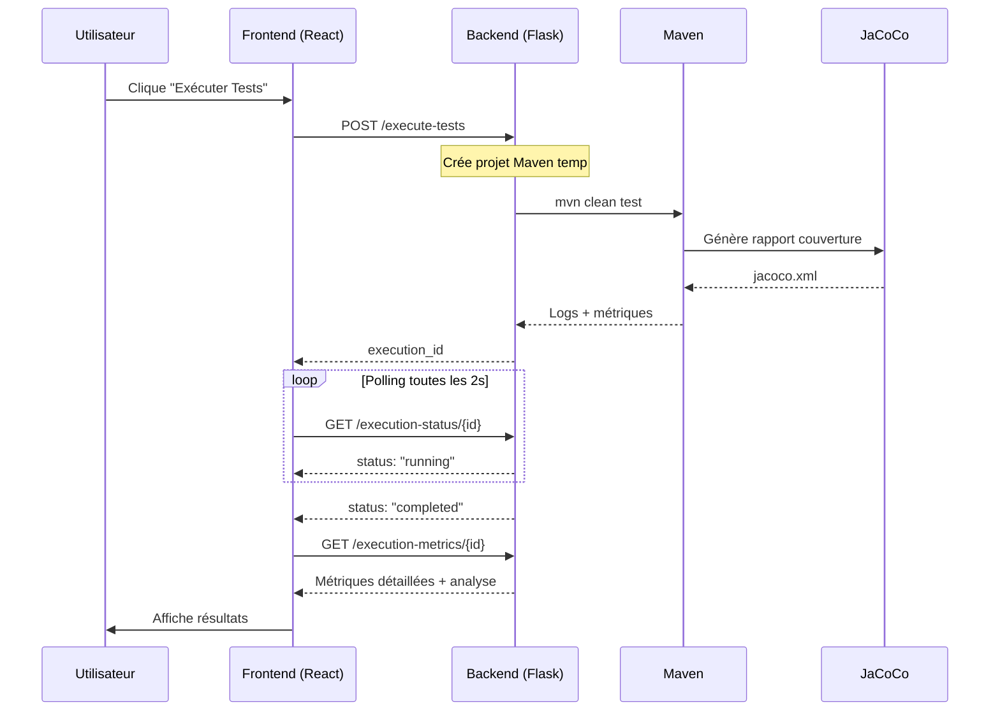

# Rapport Final - Projet AutoTest

## Livraison des Épiques #1 et #4

**Date de livraison:** Novembre 2025  
**Équipe:** PFE04-A25

---

## Table des Matières

1. [Résumé Exécutif](#résumé-exécutif)
2. [Contexte et Problématique](#contexte-et-problématique)
3. [Objectifs du Projet](#objectifs-du-projet)
4. [Épique #1 - Amélioration de la Base de Données](#épique-1---amélioration-de-la-base-de-données)
5. [Épique #4 - Module d'Exécution et d'Évaluation](#épique-4---module-dexécution-et-dévaluation)
6. [Revue par Rapport à la Planification](#revue-par-rapport-à-la-planification)
7. [Risques et Mitigations](#risques-et-mitigations)
8. [Conclusion et Perspectives](#conclusion-et-perspectives)

---

## Résumé Exécutif

Ce rapport présente les réalisations accomplies dans le cadre des épiques #1 (Amélioration de la DB) et #4 (Intégration d'un module d'exécution et d'évaluation des cas de tests générés par LLM) du projet AutoTest. Le projet vise à démontrer une preuve de concept (PoC) pour la génération automatique de tests à partir de code fourni, en utilisant des modèles LLM (Large Language Models).

Les deux épiques ont été complétés avec succès, permettant d'atteindre les objectifs suivants :
- Une architecture de base de données moderne et modulaire
- Un système complet de traçabilité des ressources (prompts, LLM, pipelines)
- Un module d'exécution automatique des tests avec collecte de métriques détaillées
- Une interface utilisateur interactive pour la visualisation des résultats

---

## Contexte et Problématique

Lors de la production de projets de programmation, l'écriture de tests est un élément essentiel au cycle de vie du projet. Cependant, cette tâche demande des ressources significatives des développeurs. Avec les avancées récentes en intelligence artificielle, les LLM sont de plus en plus performants pour comprendre et générer du code.

Le projet AutoTest vise à utiliser cette technologie pour générer des tests automatiquement, réduisant ainsi les efforts nécessaires pour produire une suite de tests complète et fonctionnelle. Le projet existant nécessitait des améliorations majeures :

1. **Architecture de base de données limitée** : Une seule table sans traçabilité des ressources
2. **Absence de mécanisme de validation** : Pas de moyen de valider automatiquement les tests générés
3. **Manque de métriques** : Pas de feedback sur la qualité des tests générés

---

## Objectifs du Projet

### Objectifs Globaux

- Générer des tests unitaires exécutables pour au moins 3 langages (Java, Python, JavaScript)
- Générer une rétroaction sur l'exécution des tests générés
- Produire une documentation complète des changements
- Rendre l'utilisation des LLMs plus modulaire
- Améliorer le pipeline de génération

### Objectifs Spécifiques des Épiques

#### Épique #1 - Amélioration de la DB
- Système pour annoter le feedback de la génération
- Traçabilité du LLM et du prompt utilisé

#### Épique #4 - Module d'Exécution
- Moteur d'exécution des tests générés
- Collecte et exposition des métriques d'exécution
- Support de différents scénarios d'erreurs

---

## Épique #1 - Amélioration de la Base de Données

### État Initial

L'architecture initiale comprenait une seule table `test_case` avec des limitations importantes :



**Problèmes identifiés :**
- Tests agrégés dans une seule ligne de la table
- Absence de feedback ou mécanisme de scoring
- Manque d'informations essentielles (LLM utilisé, version du prompt, timestamp)

### Architecture Implémentée

Une nouvelle architecture modulaire a été mise en place suivant le **Repository Design Pattern** :

```
db/
├── models/          # Modèles de données représentant les entités
├── repositories/    # Couche d'accès aux données (CRUD)
└── services/        # Couche logique métier
```

#### Nouveaux Modèles de Données



### Réalisations Accomplies

| Tâche | Statut | Description |
|-------|--------|-------------|
| Issue #11 - Architecture prompts/LLM | ✅ Complété | Modification de la DB pour tracer les prompts et LLM utilisés |
| Issue #12 - Architecture métriques | ✅ Complété | Ajout des tables pour les métriques d'exécution |
| Issue #13 - Implémentation workflow | ✅ Complété | Intégration de la nouvelle DB dans le workflow |
| Issue #18 - Refactoring DB | ✅ Complété | Modularisation des accès à la DB |

### Bénéfices de la Nouvelle Architecture

1. **Séparation des Préoccupations** : Chaque couche a une responsabilité unique
2. **Maintenabilité Améliorée** : Les changements de base de données n'impactent pas le frontend
3. **API Cohérente** : Endpoints standardisés pour toutes les opérations
4. **Testabilité Accrue** : Chaque couche peut être testée indépendamment
5. **Scalabilité** : Le backend peut être mis à l'échelle séparément du frontend

---

## Épique #4 - Module d'Exécution et d'Évaluation

### Problématique

Il n'existait aucun mécanisme pour :
- Valider automatiquement le code généré par le LLM
- Mesurer la pertinence et qualité des tests générés
- Fournir un feedback utile pour l'itération sur les prompts

### Solution Implémentée

Un module complet d'exécution a été développé permettant :

#### 1. Exécution Automatique des Tests

Le système crée un projet Maven temporaire avec :
- Configuration automatique du `pom.xml` avec Spring Boot et JaCoCo
- Structure Maven standard (`src/main/java` et `src/test/java`)
- Exécution via `mvn clean test jacoco:report`

```
temp_project/
├── pom.xml
├── src/
│   ├── main/java/com/test/
│   │   └── TestApplication.java  ← Code API
│   └── test/java/com/test/
│       └── GeneratedTest.java    ← Tests générés
└── target/site/jacoco/
    └── jacoco.xml                ← Rapport de couverture
```

#### 2. Métriques Collectées

| Métrique | Source | Description |
|----------|--------|-------------|
| `tests_run` | Maven Surefire | Nombre total de tests exécutés |
| `failures` | Maven Surefire | Nombre de tests échoués |
| `errors` | Maven Surefire | Nombre d'erreurs d'exécution |
| `success_rate` | Calculé | Taux de succès des tests |
| `line_coverage` | JaCoCo | Pourcentage de lignes couvertes |
| `branch_coverage` | JaCoCo | Pourcentage de branches couvertes |
| `instruction_coverage` | JaCoCo | Pourcentage d'instructions couvertes |
| `execution_time` | Système | Temps d'exécution |

#### 3. Analyse de Qualité

Le système fournit une analyse automatique de la qualité :

**Niveaux de Couverture :**
- **Excellent** : Line ≥90%, Branch ≥85%
- **Bon** : Line ≥80%, Branch ≥70%
- **Acceptable** : Line ≥60%, Branch ≥50%
- **Insuffisant** : En dessous des seuils acceptables

**Score Global (0-100) :**
```
coverage_score = line_coverage * 0.4 + branch_coverage * 0.4 + instruction_coverage * 0.2
test_score = min(100, tests_per_endpoint * 25)
overall_score = coverage_score * 0.7 + test_score * 0.3
```

#### 4. API Endpoints

| Endpoint | Méthode | Description |
|----------|---------|-------------|
| `/execute-tests` | POST | Lance l'exécution des tests |
| `/execution-status/{id}` | GET | Récupère le statut d'exécution |
| `/execution-metrics/{id}` | GET | Récupère les métriques détaillées |

### Réalisations Accomplies

| Tâche | Statut | Description |
|-------|--------|-------------|
| Issue #8 - Module d'exécution BE | ✅ Complété | Création du module backend d'exécution |
| Issue #9 - Feedback interface FE | ✅ Complété | Affichage des résultats sur l'interface |
| Issue #10 - Documentation et tests | ✅ Complété | Documentation complète du module |

### Flux d'Exécution



---

## Revue par Rapport à la Planification

### Méthodologie Suivie

Le projet a suivi l'approche itérative en cascade définie, comportant les 3 étapes clés :

1. **Recherches et définition des requis** ✅
   - Identification des améliorations possibles du projet actuel
   - Définition des tâches au travers de la session
   - Révision des standards de tests et projets basés sur l'IA

2. **Conception et proposition des améliorations** ✅
   - Définition des améliorations basées sur le prototype existant
   - Documentation des améliorations et présentation aux gestionnaires
   - Définition des critères d'acceptation

3. **Implémentation et développement** ✅
   - Mise en place des améliorations au travers de sprints
   - Communication des avancements et bloquants
   - Tests et documentation du prototype

### Techniques et Outils Utilisés

| Catégorie | Outil | Utilisé |
|-----------|-------|---------|
| Backend | Python 3.10+, Flask | ✅ |
| DB | MongoDB | ✅ |
| LLM | Gemini | ✅ |
| Exécution tests | Maven, JUnit, JaCoCo | ✅ |
| CI | GitHub Actions | ✅ |
| Frontend | React, Next.js | ✅ |

### Objectifs SMART - Évaluation

| Objectif | Statut | Commentaire |
|----------|--------|-------------|
| Tests unitaires pour 3+ langages | 🔄 En cours | Support Java (RestAssured) implémenté, autres langages en développement |
| Rétroaction sur l'exécution | ✅ Atteint | Métriques complètes (couverture, succès, logs) |
| Documentation complète | ✅ Atteint | Documentation dans le dossier `doc/` |
| Modularisation des LLMs | ✅ Atteint | Architecture pipeline modulaire |
| Amélioration pipeline génération | ✅ Atteint | Pipelines modulaires avec prompts configurables |

---

## Risques et Mitigations

### Analyse des Risques Identifiés

| Risque | Impact Prévu | Résultat Réel | Mitigation Appliquée |
|--------|--------------|---------------|----------------------|
| Code LLM non-exécutable | Retard | ✅ Géré | Post-processing, validation, timeouts |
| Ressources insuffisantes pour LLM local | Retard | ✅ Évité | Utilisation de Gemini API (cloud) |
| Portée trop ambitieuse | Non-livrable | ✅ Géré | Priorisation RestAssured pour PoC |
| Faible qualité tests générés | Mauvais résultat | 🔄 En amélioration | Boucle d'amélioration des prompts |
| Tests qui passent sans tester | Fausse confiance | ✅ Géré | Métriques de couverture JaCoCo |
| Sous-estimation debugging | Retard cumulatif | ⚠️ Partiellement | Code reviews, documentation |
| Pipeline métriques incomplet | Fonctionnalité réduite | ✅ Géré | Tests d'intégration, CI |

---

## Conclusion et Perspectives

### Accomplissements Majeurs

1. **Architecture Modernisée** : Migration vers une architecture modulaire avec Repository Pattern
2. **Traçabilité Complète** : Suivi des prompts, LLMs et pipelines utilisés
3. **Module d'Exécution Fonctionnel** : Exécution automatique avec métriques JaCoCo
4. **Documentation Exhaustive** : Documentation technique complète

### Perspectives d'Amélioration

1. **Support Multi-langages** : Étendre le support à Python (pytest) et JavaScript (Jest)
2. **Amélioration des Prompts** : Itérations continues sur les templates de prompts
3. **Visualisation des Données** : Tableaux de bord pour analyser les tendances
4. **Fine-tuning** : Utilisation des données collectées pour améliorer les modèles
5. **Tests de Performance** : Intégration avec JMeter/Gatling pour les tests de charge

### Recommandations

- Continuer l'itération sur les prompts en utilisant les métriques collectées
- Implémenter les tests pour les autres types (unitaires Python, Jest)
- Développer des visualisations pour exploiter les données de la base de données
- Considérer l'ajout d'un feedback utilisateur pour améliorer la qualité

---

## Annexes

### A. Références

1. Y. Dong et al., "*A Survey on Code Generation with LLM-based Agents*", arXiv:2508.00083, 2025
2. IBM Technology, "*What is MCP? Integrate AI Agents with Databases & APIs*", YouTube, Aug. 2024
3. Google, "Modèles Gemini – Gemini API", Google AI for Developers, Oct. 2025
4. C.-Y. Wang et al., "Selection of Prompt Engineering Techniques for Code Generation", Oct. 2025

### B. Documentation Technique

- [Architecture de la Base de Données](./backend/db.md)
- [Module d'Exécution de Tests](./backend/test_execution_module.md)

### C. Issues Associées

**Épique #1 - Amélioration de la DB:**
- [#11 - Modifier l'architecture pour enregistrer les prompts et LLM utilisés](https://github.com/PFE04-A25/PFE04/issues/11)
- [#12 - Modifier l'architecture pour contenir les métriques](https://github.com/PFE04-A25/PFE04/issues/12)
- [#13 - Implémenter la nouvelle DB dans le workflow d'exécution](https://github.com/PFE04-A25/PFE04/issues/13)
- [#18 - Refactoring DB](https://github.com/PFE04-A25/PFE04/issues/18)

**Épique #4 - Module d'Exécution:**
- [#8 - Créer un module permettant l'exécution automatique des cas de tests](https://github.com/PFE04-A25/PFE04/issues/8)
- [#9 - Ajouter un feedback sur l'interface avec les métriques d'exécution](https://github.com/PFE04-A25/PFE04/issues/9)
- [#10 - Documenter et tester le module d'exécution](https://github.com/PFE04-A25/PFE04/issues/10)

---

*Document généré le 29 novembre 2025*
